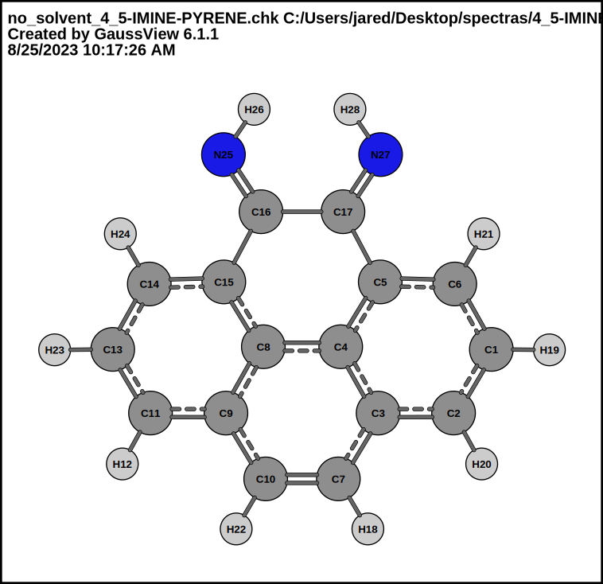
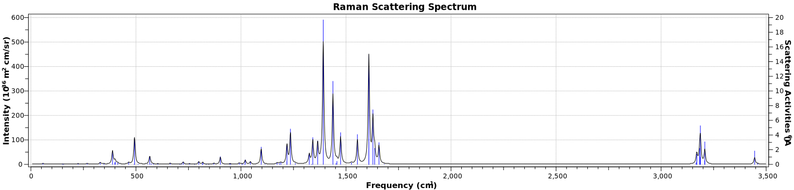
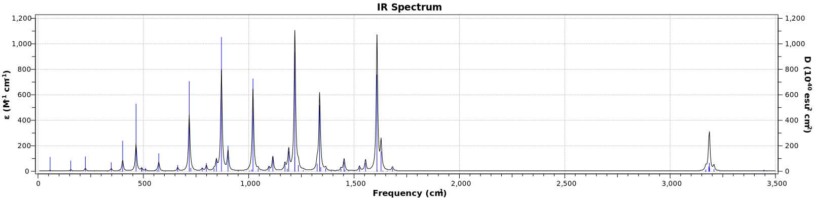

# 4_5-IMINE-PYRENE-EtOH

## Input file (general structure coming soon)

<pre>
```bash
%nprocshared=4
%mem=4GB
%chk=C:\Users\jared\Desktop\spectras\4-ONE_5-IMINE-PYRENE_EtOH\solvent\4_5-IMINE-PYRENE.chk
# freq=raman b3lyp/6-311++g(d,p)

Title Card Required

0 1 
 C                 -3.53067833   -0.50651839    0.00001203
 C                 -2.80438817   -1.68367941    0.00001003
 C                 -1.39320107   -1.67404227   -0.00000298
 C                 -0.70925313   -0.42801112   -0.00001598
 C                 -1.47254130    0.76875990   -0.00002498
```
</pre>

The structure that I generated in gaussview (tutorial coming soon):


## Raman Spectra of molecule

  

[Text File of Raman Spectra](./4_5-IMINE-PYRENE_EtOH_RAMAN.txt)  

[Click here to see the vibrations corresponding to the frequency -- in the form of a youtube video](https://youtu.be/WoUj-lxuMKM)  

### IR Spectra
  

[Text File of IR Spectra](./4_5-IMINE-PYRENE_EtOH_IR.txt)  

[Click here to see the vibrations corresponding to the frequency -- in the form of a youtube video](https://youtu.be/WoUj-lxuMKM)
